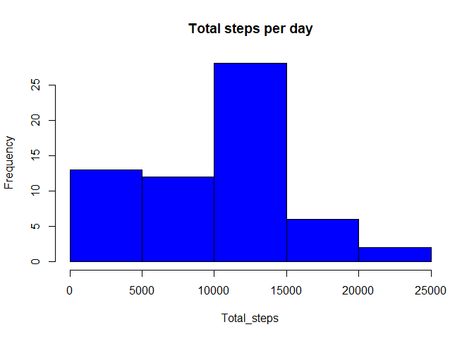
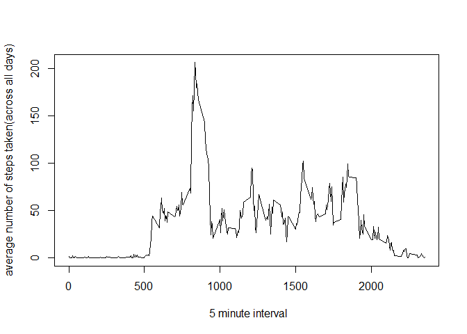
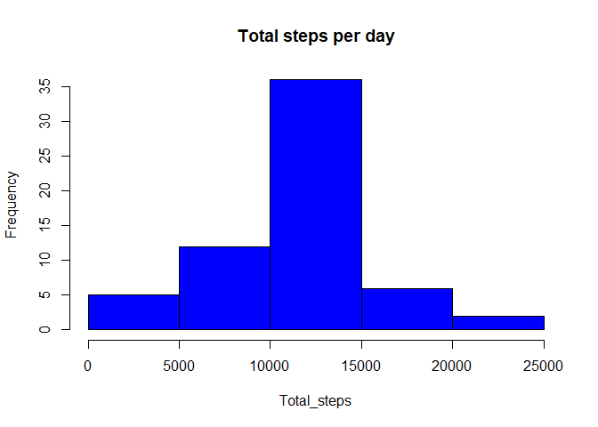
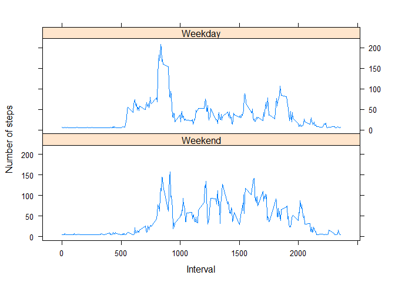

```r
library(data.table)
```

## Loading and preprocessing the data


```r
activity_data<-read.csv("activity.csv")
activity_data<-as.data.table(activity_data)
```

## What is mean total number of steps taken per day?


### 1.Calculate the total number of steps taken per day

```r
total_steps_per_day<-activity_data[,list(total_steps=sum(steps,na.rm = TRUE)),by=date]
```

###2.If you do not understand the difference between a histogram and a barplot, research the difference between them. Make a histogram of the total number of steps taken each day


```r
 hist(total_steps_per_day$total_steps,main = "Total steps per day",col="blue",xlab= "Total_steps")
```

<!-- -->


##Calculate and report the mean and median of the total number of steps taken per day


```r
mean(total_steps_per_day$total_steps)
```

```
## [1] 9354.23
```


```r
median(total_steps_per_day$total_steps)
```

```
## [1] 10395
```

## What is the average daily activity pattern?

###1.Make a time series plot (type="l") of the 5-minute interval (x-axis) and the average number of steps taken, averaged across all days (y-axis)


```r
avg_steps_per_day<-activity_data[,list(avg_steps=mean(steps,na.rm = TRUE)),by=interval]
avg_steps_per_day
```

```
##      interval avg_steps
##   1:        0 1.7169811
##   2:        5 0.3396226
##   3:       10 0.1320755
##   4:       15 0.1509434
##   5:       20 0.0754717
##  ---                   
## 284:     2335 4.6981132
## 285:     2340 3.3018868
## 286:     2345 0.6415094
## 287:     2350 0.2264151
## 288:     2355 1.0754717
```


```r
plot(x=avg_steps_per_day$interval,y=avg_steps_per_day$avg_steps,xlab = " 5 minute interval",ylab = "average number of steps taken(across all days)",type="l")
```

<!-- -->

###2.Which 5-minute interval, on average across all the days in the dataset, contains the maximum number of steps?


```r
 avg_steps_per_day[which(avg_steps==max(avg_steps))]
```

```
##    interval avg_steps
## 1:      835  206.1698
```


## Imputing missing values


###1.Calculate and report the total number of missing values in the dataset (i.e. the total number of rows with NAs)


```r
missing_values<-is.na(activity_data$steps)
sum(missing_values)
```

```
## [1] 2304
```

###2.Devise a strategy for filling in all of the missing values in the dataset. The strategy does not need to be sophisticated. For example, you could use the mean/median for that day, or the mean for that 5-minute interval, etc.
#### here,using mean imputation
###3.Create a new dataset that is equal to the original dataset but with the missing data filled in.


```r
activity_data_2<-activity_data
```

####finding the mean of steps of non na values

```r
mean(activity_data_2$steps[!is.na(activity_data_2$steps)])
```

```
## [1] 37.3826
```


####replacing the missing values in the activity_data_2 with the mean of non na value,ie impute missing values

```r
activity_data_2$steps[is.na(activity_data_2$steps)]<-mean(activity_data_2$steps[!is.na(activity_data_2$steps)])
head(activity_data_2$steps)
```

```
## [1] 37.3826 37.3826 37.3826 37.3826 37.3826 37.3826
```

###4.Make a histogram of the total number of steps taken each day and Calculate and report the mean and median total number of steps taken per day. Do these values differ from the estimates from the first part of the assignment? What is the impact of imputing missing data on the estimates of the total daily number of steps?

####calculate the total number of steps per day 

```r
total_steps_per_day<-activity_data_2[,list(total_steps=sum(steps)),by=date]
```

####Make a histogram of the total number of steps taken each day


```r
hist(total_steps_per_day$total_steps,main = "Total steps per day",col="blue",xlab= "Total_steps")
```

<!-- -->

####Calculate and report the mean and median total number of steps taken per day.
###### calculating mean

```r
mean(total_steps_per_day$total_steps)
```

```
## [1] 10766.19
```

######calculating median

```r
median(total_steps_per_day$total_steps)
```

```
## [1] 10766.19
```

####the mean and median values obtained from dataset activity_data  and activity_data_2(after imputing missing values )is different.The mean and median of activity_data is not same(ie,mean=9354.23 and median=10395) where as the values of mean and median of second dataset ie,activity_data_2 is same.(mean=10766.19 and median=10766.19)


## Are there differences in activity patterns between weekdays and weekends?

###For this part the weekdays() function may be of some help here. Use the dataset with the filled-in missing values for this part.

####1.Create a new factor variable in the dataset with two levels - "weekday" and "weekend" indicating whether a given date is a weekday or weekend day.


```r
activity_data_2$date<-as.Date(activity_data_2$date)

activity_data_2$day<-factor((weekdays(activity_data_2$date) %in% c("Saturday","Sunday") ),levels=c(TRUE,FALSE),labels=c("Weekend","Weekday"))
```

###2.Make a panel plot containing a time series plot (i.e. \color{red}{\verb|type = "l"|}type="l") of the 5-minute interval (x-axis) and the average number of steps taken, averaged across all weekday days or weekend days (y-axis). 

####finding average number of steps across weekday and weekend

```r
summarized_day<-activity_data_2[,list(average=mean(steps)),by=c("day","interval")]
summarized_day
```

```
##          day interval   average
##   1: Weekday        0  7.006569
##   2: Weekday        5  5.384347
##   3: Weekday       10  5.139902
##   4: Weekday       15  5.162124
##   5: Weekday       20  5.073235
##  ---                           
## 572: Weekend     2335 15.672825
## 573: Weekend     2340 10.547825
## 574: Weekend     2345  6.297825
## 575: Weekend     2350  4.672825
## 576: Weekend     2355  4.672825
```

####creating plot using lattice plotting 

```r
library(lattice)
xyplot(average ~ interval|day,summarized_day,xlab="Interval",ylab="Number of steps",type="l",layout=c(1,2))
```

<!-- -->
 

 


